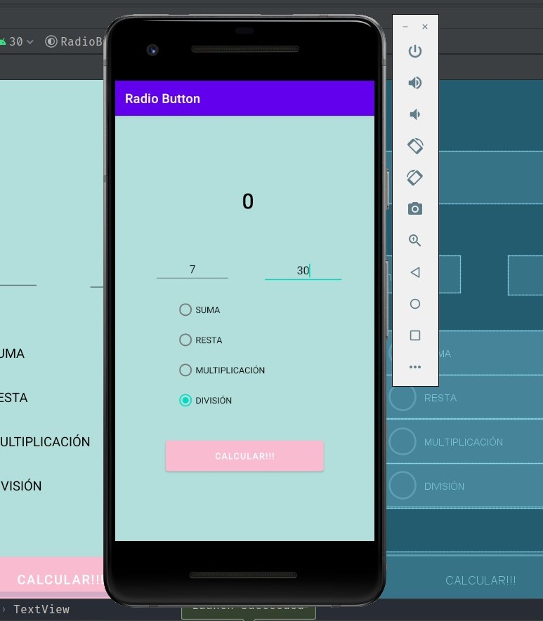

# MODULO 3 | Desarrollo de Aplicaciones Móviles Android Java | Ignacio Cavallo

---

## Clase 38 | 22-06


Seguimos con la calculadora de la clase anterior, pero esta vez aplicando: 
* [**ImageButton**](##imagebutton)
* [**RadioButton**](##radiobutton)  

*Como siempre el código al final de este [readme!](##código).*

## ImageButton

### Suma ImageButton


### Resta ImageButton

  
  
### Multiplicación ImageButton


### División ImageButton


## RadioButton

### Suma RadioButton

  

### Resta RadioButton

  

### Multiplicación RadioButton

  

### División RadioButton



## Código

### ImageButton Code

 ```java
 package com.example.imagebutton;

import androidx.appcompat.app.AppCompatActivity;

import android.annotation.SuppressLint;
import android.os.Bundle;
import android.view.View;
import android.widget.EditText;
import android.widget.TextView;

public class MainActivity extends AppCompatActivity {
    private EditText n1, n2;
    private TextView resultado, operacion;
    private int valorUno, valorDos;


    @Override
    protected void onCreate(Bundle savedInstanceState) {
        super.onCreate(savedInstanceState);
        setContentView(R.layout.activity_main);
        n1 = findViewById(R.id.num1);
        n2 = findViewById(R.id.num2);
        resultado = findViewById(R.id.textView4);
        operacion = findViewById(R.id.textView5);


    }

    @SuppressLint("SetTextI18n")
    public void sumar(View v) {
        valorUno = Integer.parseInt(n1.getText().toString());
        valorDos = Integer.parseInt(n2.getText().toString());
        String string1 = n1.getText().toString();
        String string2 = n2.getText().toString();
        resultado.setText(Integer.toString(valorUno + valorDos));
        operacion.setText(string1 + " + " + string2);
    }
    public void restar(View v) {
        valorUno = Integer.parseInt(n1.getText().toString());
        valorDos = Integer.parseInt(n2.getText().toString());
        String string1 = n1.getText().toString();
        String string2 = n2.getText().toString();
        operacion.setText(string1 + " - " + string2);
        resultado.setText(Integer.toString(valorUno - valorDos));
    }
    public void multiplicar(View v) {
        valorUno = Integer.parseInt(n1.getText().toString());
        valorDos = Integer.parseInt(n2.getText().toString());
        String string1 = n1.getText().toString();
        String string2 = n2.getText().toString();
        operacion.setText(string1 + " * " + string2);
        resultado.setText(Integer.toString(valorUno * valorDos));
    }

    public void dividir(View v) {
        valorUno = Integer.parseInt(n1.getText().toString());
        valorDos = Integer.parseInt(n2.getText().toString());
        String string1 = n1.getText().toString();
        String string2 = n2.getText().toString();
        operacion.setText(string1 + " / " + string2);
        resultado.setText(Integer.toString(valorUno / valorDos));
    }


}
```

###  RadioButton Code
```java
package com.example.radiobutton;

import androidx.appcompat.app.AppCompatActivity;

import android.graphics.Color;
import android.os.Bundle;
import android.view.View;
import android.widget.EditText;
import android.widget.RadioButton;
import android.widget.TextView;

public class MainActivity extends AppCompatActivity {
    private EditText valor1, valor2;
    private RadioButton suma, resta, mult, div;
    private TextView resultado;


    @Override
    protected void onCreate(Bundle savedInstanceState) {
        super.onCreate(savedInstanceState);
        setContentView(R.layout.activity_main);
        valor1 = findViewById(R.id.inputUno);
        valor2 = findViewById(R.id.inputDos);
        suma = findViewById(R.id.suma);
        resta = findViewById(R.id.resta);
        mult = findViewById(R.id.multip);
        div = findViewById(R.id.division);
        resultado = findViewById(R.id.textView);

    }

    public void calcular(View v) {
        int n1 = Integer.parseInt(valor1.getText().toString());
        int n2 = Integer.parseInt(valor2.getText().toString());

        if (suma.isChecked()) {
            resultado.setText(Integer.toString(n1 + n2));
            resultado.setTextColor((n1+n2)>0? Color.GREEN:Color.RED);

        } else if (resta.isChecked()) {
            resultado.setText(Integer.toString(n1 - n2));
            resultado.setTextColor((n1-n2)>0? Color.GREEN:Color.RED);
        } else if (mult.isChecked()) {
            resultado.setText(Integer.toString(n1 * n2));
            resultado.setTextColor(Color.BLACK);
        }else if(div.isChecked()){
            resultado.setText(Integer.toString((n2 != 0) ? (n1 / n2) : 0));

        }
    }
}
```