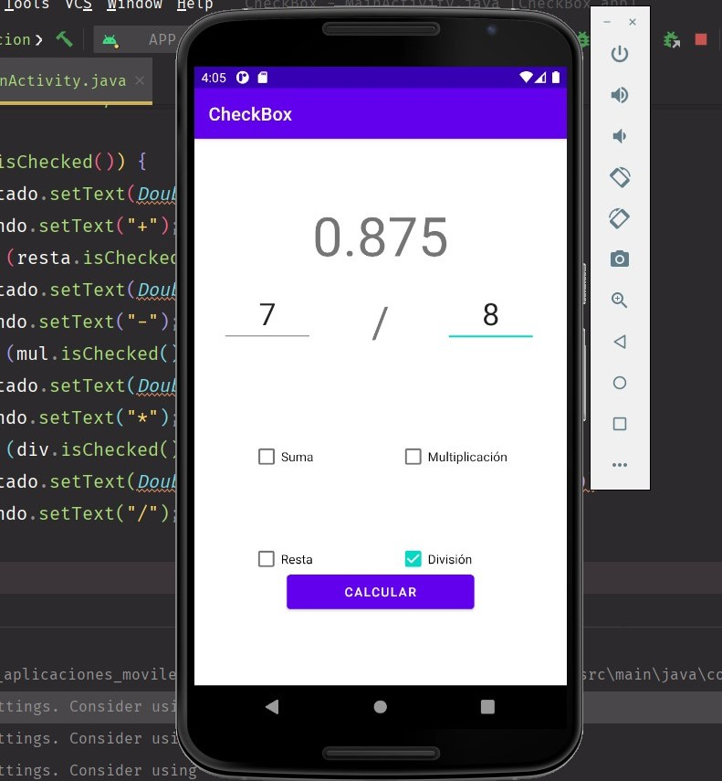

# MODULO 3 | Desarrollo de Aplicaciones Móviles Android Java | Ignacio Cavallo


#### https://github.com/cavigna/modulo_desarrollo_de_aplicaciones_moviles_android_java

## Clase 39 | 23-06


Seguimos con la calculadora de las clases anteriorers, pero esta vez aplicando: 
* **CheckBox**


*Como siempre el código al final de este [readme!](#código).*

## CheckBox

### Suma 


### Resta 

  
  
### Multiplicación 


### División 




## Código

### ImageButton Code

 ```java
 package com.example.checkbox;

import androidx.appcompat.app.AppCompatActivity;

import android.os.Bundle;
import android.view.View;
import android.widget.CheckBox;
import android.widget.EditText;
import android.widget.TextView;

public class MainActivity extends AppCompatActivity {
    private TextView operando, resultado;
    private CheckBox suma, resta, mul, div;
    private EditText valor1, valor2;


    @Override
    protected void onCreate(Bundle savedInstanceState) {
        super.onCreate(savedInstanceState);
        setContentView(R.layout.activity_main);
        valor1 = findViewById(R.id.editTextNumberDecimal);
        valor2 = findViewById(R.id.editTextNumberDecimal2);
        suma = findViewById(R.id.suma);
        resta = findViewById(R.id.resta);
        mul = findViewById(R.id.Mult);
        div = findViewById(R.id.División);
        operando = findViewById(R.id.textView);
        resultado = findViewById(R.id.resultado);
    }

    public void operacion(View view) {
        double n1 = Double.parseDouble(valor1.getText().toString());
        double n2 = Double.parseDouble(valor2.getText().toString());

        if (suma.isChecked()) {
            resultado.setText(Double.toString(n1 + n2));
            operando.setText("+");
        } else if (resta.isChecked()) {
            resultado.setText(Double.toString(n1 - n2));
            operando.setText("-");
        } else if (mul.isChecked()) {
            resultado.setText(Double.toString(n1 * n2));
            operando.setText("*");
        } else if (div.isChecked()) {
            resultado.setText(Double.toString((n2 != 0) ? (n1 / n2) : 0));
            operando.setText("/");
        }

    }
}
```