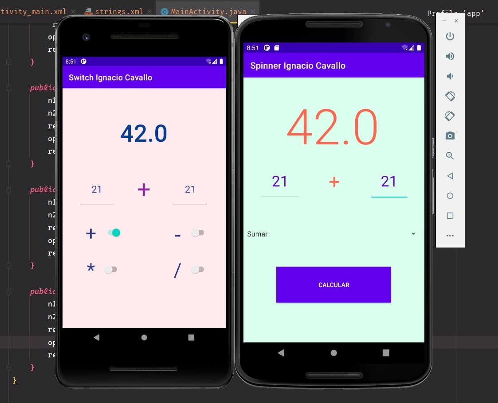
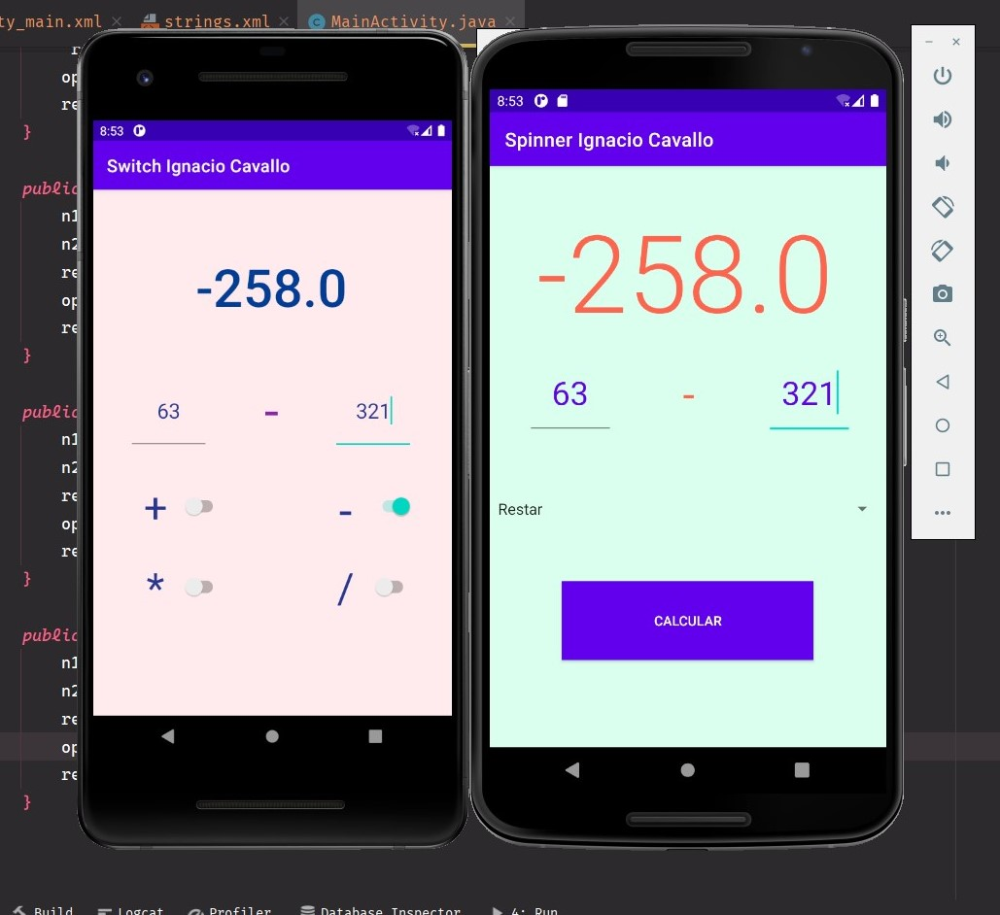
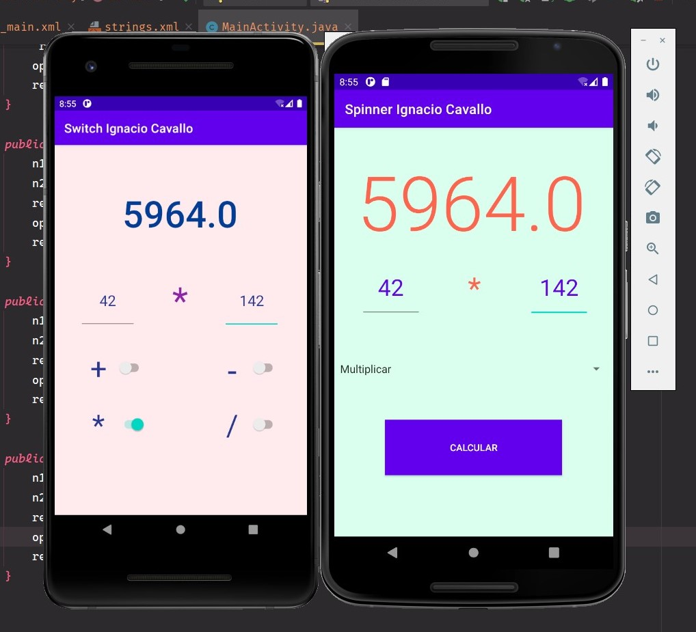
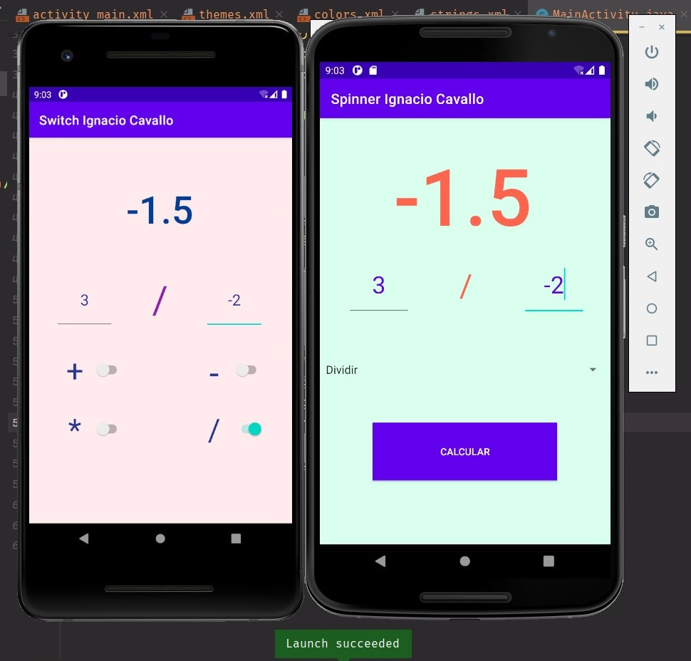

# MODULO 3 | Desarrollo de Aplicaciones Móviles Android Java | Ignacio Cavallo


#### https://github.com/cavigna/modulo_desarrollo_de_aplicaciones_moviles_android_java

## Clase 40 | 24-06


Seguimos con la calculadora de las clases anteriorers, pero esta vez aplicando: 
* **Switch**
* **Spinner**


*Como siempre el código al final de este [readme!](#código).*

## Resultado

### Suma 



### Resta 

  
  
### Multiplicación 



### División 




## Código

### Switch

 ```java
 public class MainActivity extends AppCompatActivity {
    private TextView resultado, operador;
    private EditText num1, num2;
    private Spinner spinner;
    private String[] operaciones = {"Sumar", "Restar", "Multiplicar", "Dividir"};


    @Override
    protected void onCreate(Bundle savedInstanceState) {
        super.onCreate(savedInstanceState);
        setContentView(R.layout.activity_main);

        resultado = findViewById(R.id.resultado);
        operador = findViewById(R.id.operador);

        num1 = findViewById(R.id.numeroUno);
        num2 = findViewById(R.id.numeroDos);

        spinner = findViewById(R.id.spinner);
        ArrayAdapter<String> adaptador = new ArrayAdapter<>(this,
                android.R.layout.simple_spinner_item, operaciones);
        spinner.setAdapter(adaptador);
    }

    public void calculo(View view){
        double n1 = Double.parseDouble(num1.getText().toString());
        double n2 = Double.parseDouble(num2.getText().toString());
        double res;
        String op = spinner.getSelectedItem().toString();

        if (op.equals("Sumar")){
            res = n1 + n2;
            operador.setText(" + ");
            resultado.setText(Double.toString(res));
        } else if(op.equals("Restar")){
            res = n1- n2;
            operador.setText(" - ");
            resultado.setText(Double.toString(res));
        } else if(op.equals("Multiplicar")){
            res = n1 * n2;
            operador.setText(" * ");
            resultado.setText(Double.toString(res));
        } else if(op.equals("Dividir")){
            res = n2!= 0 ? (n1 / n2):0;
            operador.setText(" / ");
            resultado.setText(Double.toString(res));
        }

    }
}
```  

### Spinner

 ```java
public class MainActivity extends AppCompatActivity {
    private EditText num1, num2;
    private TextView operador, resultado;
    private Switch suma, resta, mult, div;
    private double n1,n2, resul;


    @Override
    protected void onCreate(Bundle savedInstanceState) {
        super.onCreate(savedInstanceState);
        setContentView(R.layout.activity_main);

        num1 = (EditText) findViewById(R.id.numeroUno);
        num2 = (EditText) findViewById(R.id.numeroDos);

        operador = (TextView) findViewById(R.id.operador);
        resultado = (TextView) findViewById(R.id.resultado);

        suma = (Switch) findViewById(R.id.suma);
        resta = (Switch) findViewById(R.id.resta);
        mult = (Switch) findViewById(R.id.multi);
        div = (Switch) findViewById(R.id.division);

    }

    @SuppressLint("SetTextI18n")
    public void sumar(View view){
         n1 = Double.parseDouble(num1.getText().toString());
         n2 = Double.parseDouble(num2.getText().toString());
         resul = n1+n2;
        operador.setText(" + ");
        resultado.setText(Double.toString(resul));
    }

    public void restar(View view){
        n1 = Double.parseDouble(num1.getText().toString());
        n2 = Double.parseDouble(num2.getText().toString());
        resul = n1-n2;
        operador.setText(" - ");
        resultado.setText(Double.toString(resul));
    }

    public void multiplicar(View view){
        n1 = Double.parseDouble(num1.getText().toString());
        n2 = Double.parseDouble(num2.getText().toString());
        resul = n1*n2;
        operador.setText(" * ");
        resultado.setText(Double.toString(resul));
    }

    public void dividir(View view){
        n1 = Double.parseDouble(num1.getText().toString());
        n2 = Double.parseDouble(num2.getText().toString());
        resul = n1/n2;
        operador.setText(" / ");
        resultado.setText(Double.toString(resul));
    }
} 
```