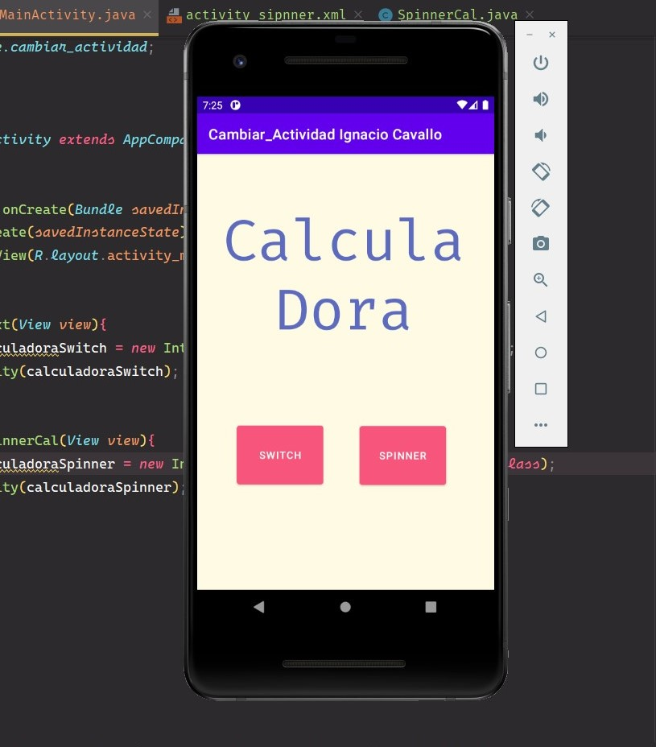
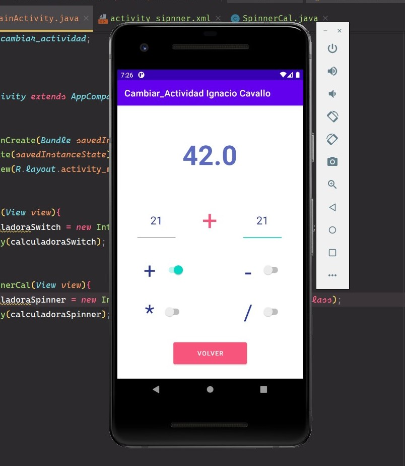
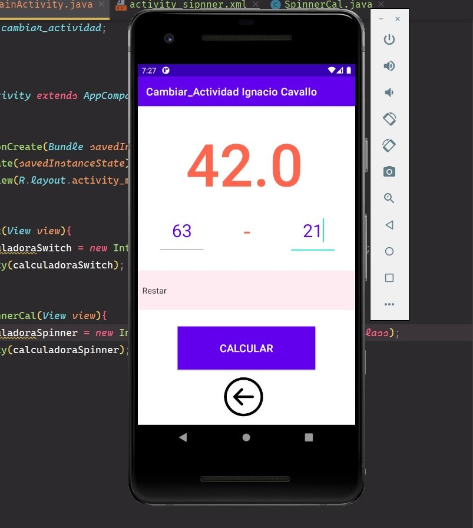

# MODULO 3 | Desarrollo de Aplicaciones Móviles Android Java | Ignacio Cavallo


#### https://github.com/cavigna/modulo_desarrollo_de_aplicaciones_moviles_android_java

## Clase 41 | 25-06


Seguimos con la calculadora de las clases anteriores, pero esta vez aplicando: 
* **Cambio de Actividad**


*Como siempre el código al final de este [readme!](#código).*

## Resultado

### MainActivity 



### Switch 

  
  
### Spinner 




## Código

### MainActivity

 ```java
package com.example.cambiar_actividad;

import androidx.appcompat.app.AppCompatActivity;

import android.content.Intent;
import android.os.Bundle;
import android.view.View;
import android.widget.Spinner;

public class MainActivity extends AppCompatActivity {

    @Override
    protected void onCreate(Bundle savedInstanceState) {
        super.onCreate(savedInstanceState);
        setContentView(R.layout.activity_main);
    }

    public void next(View view){
        Intent calculadoraSwitch = new Intent(this, Switch.class);
        startActivity(calculadoraSwitch);
    }

    public void spinnerCal(View view){
        Intent calculadoraSpinner = new Intent(this, SpinnerCal.class);
        startActivity(calculadoraSpinner);
    }
}
```
El código de las calculadoras lo pueden encontrar en:  

https://github.com/cavigna/modulo_desarrollo_de_aplicaciones_moviles_android_java/tree/main/Clase_40__24-06