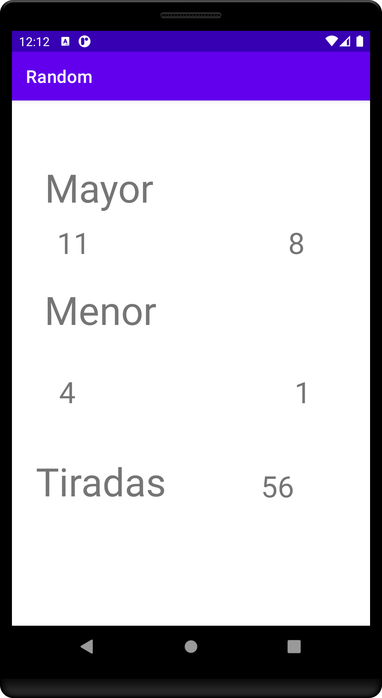

# MODULO 3 | Desarrollo de Aplicaciones Móviles Android Java | Ignacio Cavallo


#### https://github.com/cavigna/modulo_desarrollo_de_aplicaciones_moviles_android_java

## Clase 42 | 29-06


Ahora aplicaré lo aprendido en una mini app que *"tire dados"* para el juego de catan.

Esta app contendrá:
* Home(Main):
  * Contiene un boton a la app principal.

  ```java
      public void numeros(View view) {
        Intent soloNum = new Intent(this, Solo_Numeros.class);
        startActivity(soloNum);
    }
  ```

* Activity que tira los dados:
  * Al pulsar el botón arroja un número aleatorio del 2 al 12.

  ```java
      public void tirar(View view) {
        n = random.nextInt(11) + 2;
        String numCadena = Integer.toString(n);
    ```

  * Muestra ese resultado en un *TextView*.

  ```java
        res.setText(numCadena);
  ```

  * Guarda todos los números tirados en un ArrayList que posteriormente será usado por la Actividad de Estadísticas.

  ```java
        listaNumeros.add(numCadena);
  ```

  * Utiliza un *StringBuffer* para transformar el ArrayList en una cadena de texto continua que será mostada en otro *TextView*.

  ```java
    private StringBuffer stringNum = new StringBuffer();
    /*...*/

     ultimosN.setText(arrayToString(listaNumeros));
  ```

  * Este Buffer alberga solo los últimos 10 resultados con aras de obtener una interfaz más limpia.

  ```java
    public String arrayToString(ArrayList<String> listado) {
        for (String s : listado) {
            stringNum.append(s).append(" | ");
        }
        return stringNum.length() > 22 ?
                stringNum.toString().substring(stringNum.length() - 19) :
                stringNum.toString();

    }
  ```

* Una pequeña estadística de los dados tirados. En este apartado incluye  un **Intent.putStringArrayListExtra**.  Es decir, traslada el ArrayList de una actividad a la otra.  

  ```java
    public void haciaEstadistica(View view){
        Intent intent = new Intent(this, Estadisticas.class);
        intent.putStringArrayListExtra("listado", listaNumeros);
        startActivity(intent);
    }
    ```

*Como siempre el código al final de este [readme!](#código).*

## Resultado

### MainActivity 


### Dados 

  
  
### Estadísticas 



## GIF


## Código

### Dados

 ```java
package com.example.random;

import androidx.appcompat.app.AppCompatActivity;

import android.content.Intent;
import android.os.Bundle;
import android.view.View;
import android.widget.TextView;

import java.lang.reflect.Array;
import java.util.ArrayList;
import java.util.Random;

public class Solo_Numeros extends AppCompatActivity {
    private TextView res, ultimosN;
    private int n;
    private Random random = new Random();
    private StringBuffer stringNum = new StringBuffer();
    public static ArrayList<String> listaNumeros = new ArrayList<>();


    @Override
    protected void onCreate(Bundle savedInstanceState) {
        super.onCreate(savedInstanceState);
        setContentView(R.layout.activity_solo_numeros);

        try
        {
            this.getSupportActionBar().hide();
        }
        catch (NullPointerException e){}

        res = findViewById(R.id.textView);
        ultimosN = findViewById(R.id.ultimosN);
    }

    public void tirar(View view) {
        n = random.nextInt(11) + 2;
        String numCadena = Integer.toString(n);

        res.setText(numCadena);
        listaNumeros.add(numCadena);
        ultimosN.setText(arrayToString(listaNumeros));


    }

    public String arrayToString(ArrayList<String> listado) {
        for (String s : listado) {
            stringNum.append(s).append(" | ");
        }
        return stringNum.length() > 22 ?
                stringNum.toString().substring(stringNum.length() - 19) :
                stringNum.toString();

    }

    public void haciaEstadistica(View view){
        Intent intent = new Intent(this, Estadisticas.class);
        intent.putStringArrayListExtra("listado", listaNumeros);
        startActivity(intent);
    }


}


```

### Estadística

```java
package com.example.random;

import androidx.appcompat.app.AppCompatActivity;


import android.annotation.SuppressLint;
import android.os.Bundle;
import android.widget.TextView;

import java.util.ArrayList;
import java.util.Collections;
import java.util.HashMap;

public class Estadisticas extends AppCompatActivity {
    private ArrayList<String> listado = new ArrayList<>();
    private ArrayList<Integer> frecuencia = new ArrayList<>();
    private TextView maxNum, cantMaxNum, minNum, cantMinNum, tiradas;


    @SuppressLint("SetTextI18n")
    @Override
    protected void onCreate(Bundle savedInstanceState) {
        super.onCreate(savedInstanceState);
        setContentView(R.layout.activity_estadisticas);

        listado = getIntent().getStringArrayListExtra("listado");

        maxNum = findViewById(R.id.textView10);
        cantMaxNum = findViewById(R.id.textView11);
        minNum = findViewById(R.id.textView14);
        cantMinNum = findViewById(R.id.textView15);
        tiradas = findViewById(R.id.textView17);

        frecuencia.add(Collections.frequency(listado,"2"));
        frecuencia.add(Collections.frequency(listado,"3"));
        frecuencia.add(Collections.frequency(listado,"4"));
        frecuencia.add(Collections.frequency(listado,"5"));
        frecuencia.add(Collections.frequency(listado,"6"));
        frecuencia.add(Collections.frequency(listado,"7"));
        frecuencia.add(Collections.frequency(listado,"8"));
        frecuencia.add(Collections.frequency(listado,"9"));
        frecuencia.add(Collections.frequency(listado,"10"));
        frecuencia.add(Collections.frequency(listado,"11"));
        frecuencia.add(Collections.frequency(listado,"12"));
        Integer maxValue = Collections.max(frecuencia);
        int maxId =  frecuencia.indexOf(maxValue)+2;

        Integer minValue = Collections.min(frecuencia);
        int minId =  frecuencia.indexOf(minValue)+2;

        cantMaxNum.setText(Integer.toString(maxValue));
        maxNum.setText(Integer.toString(maxId));

        minNum.setText(Integer.toString(minId));
        cantMinNum.setText(Integer.toString(minValue));

        tiradas.setText(Integer.toString(listado.size()));

    }


}


```


El código  completo:  

https://github.com/cavigna/modulo_desarrollo_de_aplicaciones_moviles_android_java/tree/main/Clase_42__29-06