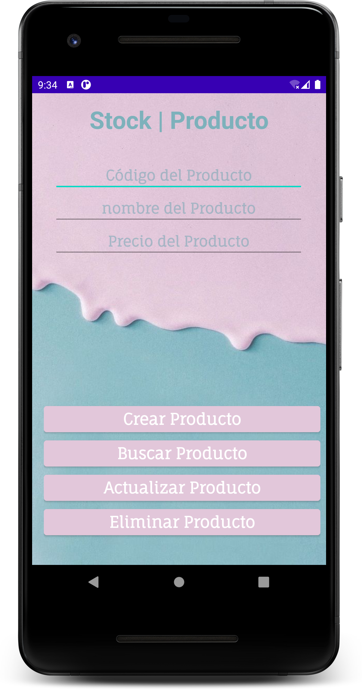
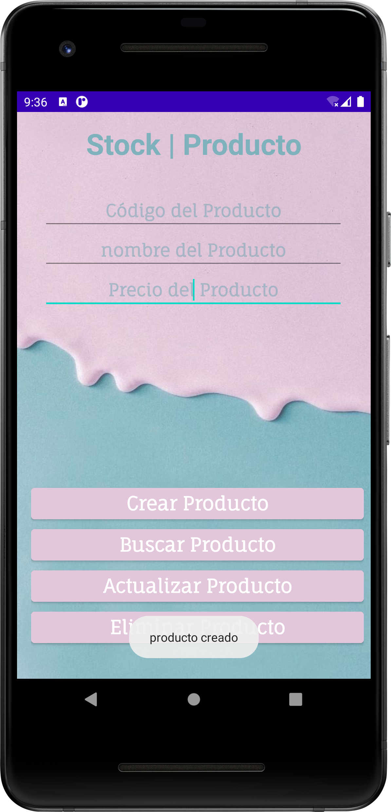
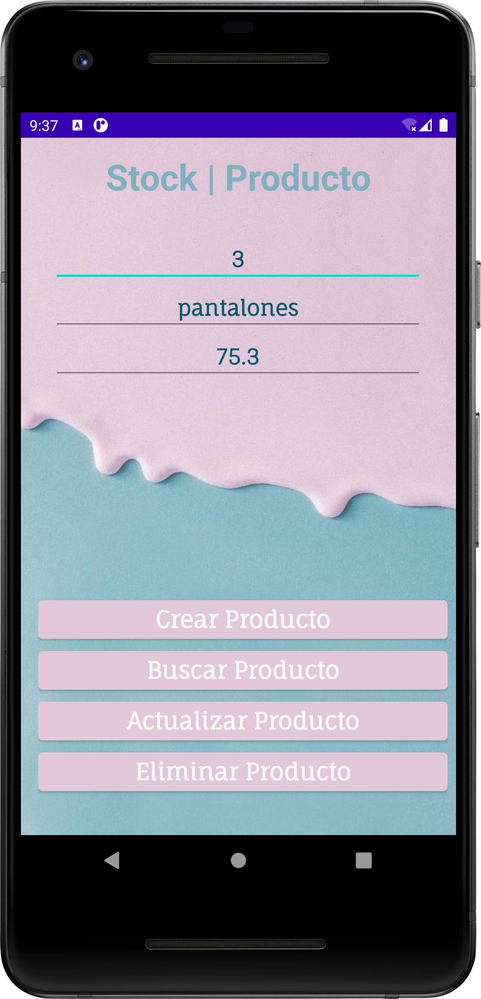

# MODULO 3 | Desarrollo de Aplicaciones Móviles Android Java | Ignacio Cavallo


#### https://github.com/cavigna/modulo_desarrollo_de_aplicaciones_moviles_android_java

## Clase 43 | 30-06


Hoy aprendimos a implementar una base de datos en SQLite. Creamos una app que nos permite agregar productos, con su código, nombre y precio.

*Como siempre el código al final de este [readme!](#código).*

## Resultado

### MainActivity 



### Agregar un Producto 

  
  
### Buscar un Producto 




## Código

### Main

 ```java
package com.example.db;

import androidx.appcompat.app.AppCompatActivity;

import android.app.ActionBar;
import android.content.ContentValues;
import android.database.Cursor;
import android.database.sqlite.SQLiteDatabase;
import android.os.Bundle;
import android.view.View;
import android.widget.EditText;
import android.widget.Toast;

import com.google.android.material.snackbar.Snackbar;

public class MainActivity extends AppCompatActivity {
    private EditText edCodigo, edNombre, edPrecio;


    @Override
    protected void onCreate(Bundle savedInstanceState) {
        super.onCreate(savedInstanceState);
        setContentView(R.layout.activity_main);
        this.getSupportActionBar().hide();

        edCodigo = findViewById(R.id.codigo);
        edNombre = findViewById(R.id.nombre);
        edPrecio = findViewById(R.id.precio);
    }


    public void crear(View view) {
        AdminDB admin = new AdminDB(this, "producto", null, 1);
        SQLiteDatabase base = admin.getWritableDatabase();

        String codigo = edCodigo.getText().toString();
        String nombre = edNombre.getText().toString();
        String precio = edPrecio.getText().toString();

        if (!codigo.isEmpty() && !nombre.isEmpty() && !precio.isEmpty()) {
            ContentValues crear = new ContentValues();
            crear.put("codigo", codigo);
            crear.put("nombre", nombre);
            crear.put("precio", precio);
            base.insert("producto", null, crear);
            base.close();
            edCodigo.getText().clear();
            edNombre.getText().clear();
            edPrecio.getText().clear();

            Toast.makeText(this, "producto creado", Toast.LENGTH_LONG).show();

        } else {
            Toast.makeText(this, "Completa todo!! Vago",
                    Toast.LENGTH_LONG).show();
        }
    }

    public void buscar(View view) {
        AdminDB admin = new AdminDB(this, "producto", null, 1);
        SQLiteDatabase base = admin.getWritableDatabase();

        String codigo = edCodigo.getText().toString();

        if (!codigo.isEmpty()) {
            Cursor fila = base.rawQuery("select nombre, precio from  producto where codigo="+ codigo, null);
            if (fila.moveToFirst()) {
                edNombre.setText(fila.getString(0));
                edPrecio.setText(fila.getString(1));
                base.close();
            } else {
                Toast.makeText(this, "No está", Toast.LENGTH_LONG).show();

            }

        } else {
            Toast.makeText(this, "Ingresa el código, gil",
                    Toast.LENGTH_LONG).show();
        }

    }

    public void actualizar(View view){
        Snackbar.make(view,"Todavía no esta implementado", Snackbar.LENGTH_SHORT).show();
    }

    public void eliminar(View view){
        Toast.makeText(this, "Todavía no está implementado",
                Toast.LENGTH_LONG).show();
    }
}

///

```


El código  completo:  

https://github.com/cavigna/modulo_desarrollo_de_aplicaciones_moviles_android_java/tree/main/Clase_43__30-06