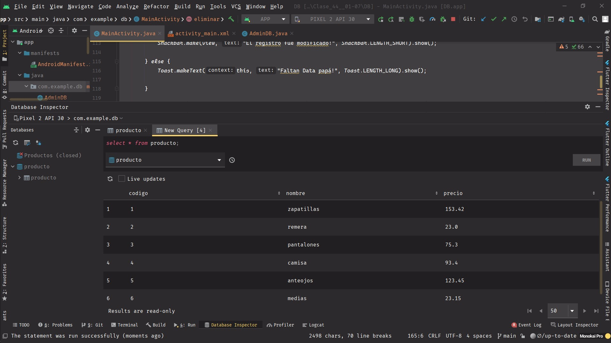
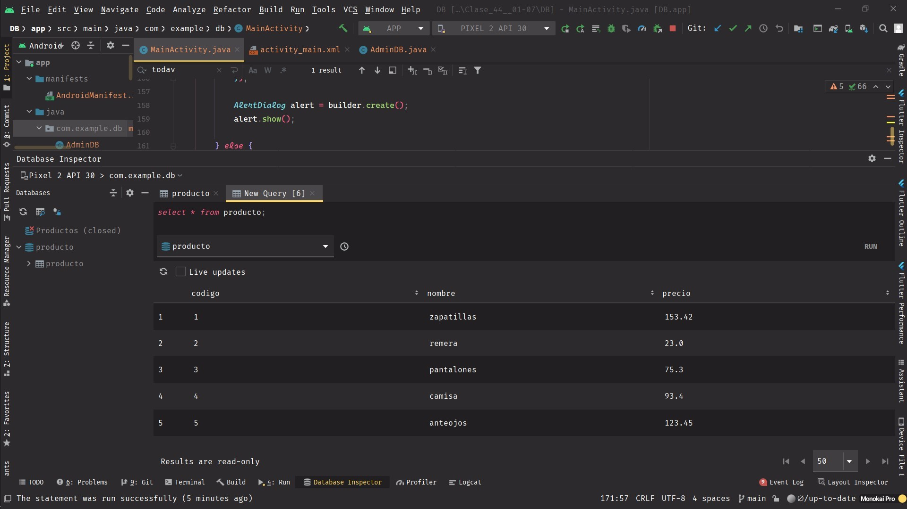

# MODULO 3 | Desarrollo de Aplicaciones Móviles Android Java | Ignacio Cavallo


#### https://github.com/cavigna/modulo_desarrollo_de_aplicaciones_moviles_android_java

## Clase 44 | 01-07


Continuamos con el [ejercicio de la ultima clase.](https://github.com/cavigna/modulo_desarrollo_de_aplicaciones_moviles_android_java/tree/main/Clase_43__30-06)   
Implementamos la lógica de los botones de actualizar registro y eliminar registro. A su vez aprendí a programar un:
* Cuadro de Dialogo:

   ```java
   AlertDialog.Builder builder = new AlertDialog.Builder(this);

            builder.setTitle("Estás a punto de borrar un registro!");
            builder.setMessage("Estás Seguro que querés eliminar esto?");

            builder.setPositiveButton("YES", new DialogInterface.OnClickListener() {

                public void onClick(DialogInterface dialog, int which) {
                    base.delete("producto", "codigo="+codigo, null);
                    limpiar();
                    base.close();

                    dialog.dismiss();
                }


            });
            Toast.makeText(this, "Registro borrado",
                    Toast.LENGTH_LONG).show();
            builder.setNegativeButton("NO", new DialogInterface.OnClickListener() {

                @Override
                public void onClick(DialogInterface dialog, int which) {
                    
                    dialog.dismiss();
                }
            });
   ``` 

* SnackBar:
   ```java
        Snackbar.make(view,"El registro fue modificado!", Snackbar.LENGTH_SHORT).show();
   ```

*Como siempre el código al final de este [readme!](#código).*

## Resultado

### Producto Original 


### Actualizar un Producto 

  
  
### Eliminar 


### Db Original



### Db Modificada




## Código

### Main

 ```java
    public void limpiar(){
        /* para no repetir tantas veces lo mismo */
        edCodigo.getText().clear();
        edNombre.getText().clear();
        edPrecio.getText().clear();
    } 

    */ --- */

        public void actualizar(View view) {
        //Snackbar.make(view,"Todavía no esta implementado", Snackbar.LENGTH_SHORT).show();
        AdminDB admin = new AdminDB(this, "producto", null, 1);
        SQLiteDatabase base = admin.getWritableDatabase();

        String codigo = edCodigo.getText().toString();
        String nombre = edNombre.getText().toString();
        String precio = edPrecio.getText().toString();


        if (!codigo.isEmpty() && !nombre.isEmpty() && !precio.isEmpty()) {
            ContentValues modificar = new ContentValues();
            modificar.put("codigo", codigo);
            modificar.put("nombre", nombre);
            modificar.put("precio", precio);
            base.update("producto", modificar, "codigo=" + codigo, null);
            limpiar();
            base.close();
            Snackbar.make(view, "El registro fue modificado!", Snackbar.LENGTH_SHORT).show();

        } else {
            Toast.makeText(this, "Faltan Data papá!", Toast.LENGTH_LONG).show();

        }


        
    }

    public void eliminar(View view) {

        AdminDB admin = new AdminDB(this, "producto", null, 1);

        SQLiteDatabase base = admin.getWritableDatabase();

        String codigo = edCodigo.getText().toString();

        if (!codigo.isEmpty()) {

            AlertDialog.Builder builder = new AlertDialog.Builder(this);
            builder.setTitle("Estás a punto de borrar un registro!");
            builder.setMessage("Estás Seguro que querés eliminar esto?");
            builder.setPositiveButton("YES", new DialogInterface.OnClickListener() {

                public void onClick(DialogInterface dialog, int which) {
                    base.delete("producto", "codigo=" + codigo, null);
                    limpiar();
                    base.close();

                    dialog.dismiss();
                }
            });
            Toast.makeText(this, 
                    "Registro borrado",
                    Toast.LENGTH_LONG).show();
            
            builder.setNegativeButton("NO", new DialogInterface.OnClickListener() {
                @Override
                public void onClick(DialogInterface dialog, int which) {
                    
                    dialog.dismiss();
                }
            });

            AlertDialog alert = builder.create();
            alert.show();

        } else {
            Toast.makeText(this, "Faltan Data papá!", Toast.LENGTH_LONG).show();
        }
    }
```


El código  completo:  

https://github.com/cavigna/modulo_desarrollo_de_aplicaciones_moviles_android_java/tree/main/Clase_44__01-07