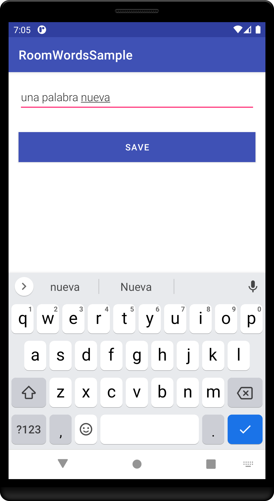

# MODULO 3 | Desarrollo de Aplicaciones Móviles Android Java | Ignacio Cavallo


#### https://github.com/cavigna/modulo_desarrollo_de_aplicaciones_moviles_android_java

## Clase 46 | 05-07


Hoy decidí aprender Android Room y seguí el tutorial de [Google](https://developer.android.com/codelabs/android-room-with-a-view).
Básicamente es utilizar sqlite pero con un intermediario, como lo es el [DAO](https://developer.android.com/reference/android/arch/persistence/room/Dao?hl=es-419).

*Como siempre el código al final de este [readme!](#código).*

Los pasos  seguir son los siguientes:


#### Instalar las librerias
En Gradle Modulo ``` build.gradle (Module: app) ```.
```java
    dependencies {
def room_version = "2.3.0"

implementation "androidx.room:room-runtime:$room_version"
annotationProcessor "androidx.room:room-compiler:$room_version"

// optional - RxJava2 support for Room
implementation "androidx.room:room-rxjava2:$room_version"

// optional - RxJava3 support for Room
implementation "androidx.room:room-rxjava3:$room_version"

// optional - Guava support for Room, including Optional and ListenableFuture
implementation "androidx.room:room-guava:$room_version"

// optional - Test helpers
testImplementation "androidx.room:room-testing:$room_version" 
}
```

#### Crear una Entidad
Creamos una Clase ```Word.java```.

```java
package com.example.android.roomwordssample;


import androidx.room.ColumnInfo;
import androidx.room.Entity;
import androidx.room.PrimaryKey;
import androidx.annotation.NonNull;


@Entity(tableName = "word_table")
public class Word {

    @PrimaryKey
    @NonNull
    @ColumnInfo(name = "word")
    private String mWord;

    public Word(@NonNull String word) {
        this.mWord = word;
    }

    @NonNull
    public String getWord() {
        return this.mWord;
    }
}

```
#### Implementar una Interfaz DAO
Creamos una interfaz ```WordDao.java```.
también se implemento una clase *Live Data*

```JAVA
package com.example.room_tutorial;


import androidx.lifecycle.LiveData;
import androidx.room.Dao;
import androidx.room.Insert;
import androidx.room.OnConflictStrategy;
import androidx.room.Query;

import java.util.List;

@Dao
public interface WordDao {
    @Insert(onConflict = OnConflictStrategy.IGNORE)
    void insert(Word word);

    @Query("DELETE FROM word_table")
    void deleteAll();

    @Query("SELECT * FROM word_table ORDER BY word ASC")
    LiveData<List<Word>> getAlphabetizedWords();
    
}

```

#### Agregar la Base de Datos
```WordRoomDatabase.java```

```java
package com.example.room_tutorial;

import android.content.Context;

import androidx.annotation.NonNull;
import androidx.room.Database;
import androidx.room.Room;
import androidx.room.RoomDatabase;
import androidx.sqlite.db.SupportSQLiteDatabase;

import java.util.concurrent.Executor;
import java.util.concurrent.ExecutorService;
import java.util.concurrent.Executors;

@Database(entities = Word.class, version = 1, exportSchema = false)
public abstract class WordRoomDatabase extends RoomDatabase {
    public static Executor databaseWriteExecutor;
    //public static Executor databaseWriteExecutor; // revisar esto

    public abstract WordDao wordDao();

    private static volatile WordRoomDatabase INSTANCE;
    private static final int  NUMBER_OF_THREADS = 4;
    static final ExecutorService databaseWriterExecutor=
            Executors.newFixedThreadPool(NUMBER_OF_THREADS);

    static WordRoomDatabase getDatabase(final Context context){
        if (INSTANCE == null){
            synchronized (WordRoomDatabase.class){
                if (INSTANCE == null){
                    INSTANCE = Room.databaseBuilder(context.getApplicationContext(),
                            WordRoomDatabase.class, "word_database")
                            .build();
                }
            }
        }
        return INSTANCE;
    }

    /**
     * Override para agregar datos a la db.
     * Borramos la bd cada vez que es creada.
     */
    private static RoomDatabase.Callback sRoomDatabaseCallback = new RoomDatabase.Callback() {
        @Override
        public void onCreate(@NonNull SupportSQLiteDatabase db) {
            super.onCreate(db);

            databaseWriteExecutor.execute(() -> {
                WordDao dao = INSTANCE.wordDao();
                dao.deleteAll();

                Word word = new Word("Hello");
                dao.insert(word);
                word = new Word("World");
                dao.insert(word);
            });
        }
    };

}
```

#### Creamos un Repositorio
```WordRepository.java```

```java
package com.example.room_tutorial;

import android.app.Application;

import androidx.lifecycle.LiveData;

import java.util.List;

public class WordRepository {
    private WordDao mWordDao;
    private LiveData<List<Word>> mAllWords;


    WordRepository(Application application) {
        WordRoomDatabase db = WordRoomDatabase.getDatabase(application);
        mWordDao = db.wordDao();
        mAllWords = mWordDao.getAlphabetizedWords();
    }


    LiveData<List<Word>> getAllWords() {
        return mAllWords;
    }


    void insert(Word word) {
        WordRoomDatabase.databaseWriteExecutor.execute(() -> {
            mWordDao.insert(word);
        });
    }
}

```

#### Creamos un ViewModel
```WordViewModel.java```

```java
package com.example.room_tutorial;

import android.app.Application;

import androidx.lifecycle.AndroidViewModel;
import androidx.lifecycle.LiveData;

import java.util.List;

public class WordViewModel extends AndroidViewModel {
    private WordRepository mRepository;

    private final LiveData<List<Word>> mAllWords;

    public WordViewModel (Application application) {
        super(application); //revisar
        mRepository = new WordRepository(application);
        mAllWords = mRepository.getAllWords();
    }

    LiveData<List<Word>> getAllWords() { return mAllWords; }

    public void insert(Word word) { mRepository.insert(word); }
}

```

#### Agregamos un ReciclerView
```WordViewHolder.java```

```java
package com.example.room_tutorial;

import android.view.LayoutInflater;
import android.view.View;
import android.view.ViewGroup;
import android.widget.TextView;

import androidx.recyclerview.widget.RecyclerView;

class WordViewHolder extends RecyclerView.ViewHolder {
    private final TextView wordItemView;

    private WordViewHolder(View itemView) {
        super(itemView);
        wordItemView = itemView.findViewById(R.id.textView);
    }

    public void bind(String text) {
        wordItemView.setText(text);
    }

    static WordViewHolder create(ViewGroup parent) {
        View view = LayoutInflater.from(parent.getContext())
                .inflate(R.layout.recyclerview_item, parent, false);
        return new WordViewHolder(view);
    }
}

```

#### Actividad para agregar nuevas palabras
```NewWordActivity.java```
```java
public class NewWordActivity extends AppCompatActivity {

   public static final String EXTRA_REPLY = "com.example.android.wordlistsql.REPLY";

   private  EditText mEditWordView;

   @Override
   public void onCreate(Bundle savedInstanceState) {
       super.onCreate(savedInstanceState);
       setContentView(R.layout.activity_new_word);
       mEditWordView = findViewById(R.id.edit_word);

       final Button button = findViewById(R.id.button_save);
       button.setOnClickListener(view -> {
           Intent replyIntent = new Intent();
           if (TextUtils.isEmpty(mEditWordView.getText())) {
               setResult(RESULT_CANCELED, replyIntent);
           } else {
               String word = mEditWordView.getText().toString();
               replyIntent.putExtra(EXTRA_REPLY, word);
               setResult(RESULT_OK, replyIntent);
           }
           finish();
       });
   }
}
```

#### Modificamos la MainActivity
```MainActivity.java```
```java
package com.example.room_tutorial;

import androidx.appcompat.app.AppCompatActivity;
import androidx.lifecycle.ViewModelProvider;
import androidx.recyclerview.widget.LinearLayoutManager;
import androidx.recyclerview.widget.RecyclerView;

import android.content.Intent;
import android.os.Bundle;
import android.widget.Toast;

import com.google.android.material.floatingactionbutton.FloatingActionButton;

public class MainActivity extends AppCompatActivity {
    public static final int NEW_WORD_ACTIVITY_REQUEST_CODE = 1;

    private WordViewModel mWordViewModel;

    @Override
    protected void onCreate(Bundle savedInstanceState) {
        super.onCreate(savedInstanceState);
        setContentView(R.layout.activity_main);

        RecyclerView recyclerView = findViewById(R.id.recyclerview);
        final WordListAdapter adapter = new WordListAdapter(new WordListAdapter.WordDiff());
        recyclerView.setAdapter(adapter);
        recyclerView.setLayoutManager(new LinearLayoutManager(this));


        mWordViewModel = new ViewModelProvider(this).get(WordViewModel.class);


        mWordViewModel.getAllWords().observe(this, words -> {

            adapter.submitList(words);
        });

        FloatingActionButton fab = findViewById(R.id.fab);
        fab.setOnClickListener(view -> {
            Intent intent = new Intent(MainActivity.this, NewWordActivity.class);
            startActivityForResult(intent, NEW_WORD_ACTIVITY_REQUEST_CODE);
        });
    }

    public void onActivityResult(int requestCode, int resultCode, Intent data) {
        super.onActivityResult(requestCode, resultCode, data);

        if (requestCode == NEW_WORD_ACTIVITY_REQUEST_CODE && resultCode == RESULT_OK) {
            Word word = new Word(data.getStringExtra(NewWordActivity.EXTRA_REPLY));
            mWordViewModel.insert(word);
        } else {
            Toast.makeText(
                    getApplicationContext(),
                    R.string.empty_not_saved,
                    Toast.LENGTH_LONG).show();
        }
    }
}
```


## Resultado

### DB Original 


### Agregar una Palabra Nueva 

  
  


## Código

### Main

 ```java
package com.example.room_tutorial;

import androidx.appcompat.app.AppCompatActivity;
import androidx.lifecycle.ViewModelProvider;
import androidx.recyclerview.widget.LinearLayoutManager;
import androidx.recyclerview.widget.RecyclerView;

import android.content.Intent;
import android.os.Bundle;
import android.widget.Toast;

import com.google.android.material.floatingactionbutton.FloatingActionButton;

public class MainActivity extends AppCompatActivity {
    public static final int NEW_WORD_ACTIVITY_REQUEST_CODE = 1;

    private WordViewModel mWordViewModel;

    @Override
    protected void onCreate(Bundle savedInstanceState) {
        super.onCreate(savedInstanceState);
        setContentView(R.layout.activity_main);

        RecyclerView recyclerView = findViewById(R.id.recyclerview);
        final WordListAdapter adapter = new WordListAdapter(new WordListAdapter.WordDiff());
        recyclerView.setAdapter(adapter);
        recyclerView.setLayoutManager(new LinearLayoutManager(this));


        mWordViewModel = new ViewModelProvider(this).get(WordViewModel.class);


        mWordViewModel.getAllWords().observe(this, words -> {

            adapter.submitList(words);
        });

        FloatingActionButton fab = findViewById(R.id.fab);
        fab.setOnClickListener(view -> {
            Intent intent = new Intent(MainActivity.this, NewWordActivity.class);
            startActivityForResult(intent, NEW_WORD_ACTIVITY_REQUEST_CODE);
        });
    }

    public void onActivityResult(int requestCode, int resultCode, Intent data) {
        super.onActivityResult(requestCode, resultCode, data);

        if (requestCode == NEW_WORD_ACTIVITY_REQUEST_CODE && resultCode == RESULT_OK) {
            Word word = new Word(data.getStringExtra(NewWordActivity.EXTRA_REPLY));
            mWordViewModel.insert(word);
        } else {
            Toast.makeText(
                    getApplicationContext(),
                    R.string.empty_not_saved,
                    Toast.LENGTH_LONG).show();
        }
    }
}

```


El código  completo:  

https://github.com/cavigna/modulo_desarrollo_de_aplicaciones_moviles_android_java/tree/main/Clase_46__05-07