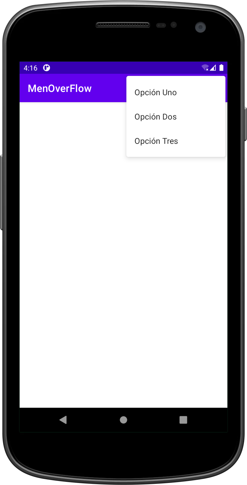

# MODULO 3 | Desarrollo de Aplicaciones Móviles Android Java | Ignacio Cavallo


#### https://github.com/cavigna/modulo_desarrollo_de_aplicaciones_moviles_android_java

## Clase 47 | 06-07


Aprendimos a construir un menú con overflow. Es un menú, pero desplegable

*Como siempre el código al final de este [readme!](#código).*


## Resultado



 


## Código

### Main

 ```java
package com.example.menoverflow;

import androidx.appcompat.app.AppCompatActivity;

import android.os.Bundle;
import android.view.Menu;
import android.view.MenuItem;
import android.widget.Toast;

public class MainActivity extends AppCompatActivity {

    @Override
    protected void onCreate(Bundle savedInstanceState) {
        super.onCreate(savedInstanceState);
        setContentView(R.layout.activity_main);
    }

    public boolean onCreateOptionsMenu(Menu menu){
        getMenuInflater().inflate(R.menu.menu_over_flow, menu);
        return true;
    }

    public boolean onOptionsItemSelected(MenuItem item){
        int id = item.getItemId();

        if(id == R.id.item1){
            Toast.makeText(this, "Opción 1",
                    Toast.LENGTH_LONG).show();
        }else if(id == R.id.item2){
            Toast.makeText(this, "Opción 2",
                    Toast.LENGTH_LONG).show();
        }else if(id == R.id.item3){
            Toast.makeText(this, "Opción 3",
                    Toast.LENGTH_LONG).show();
        }

        return super.onOptionsItemSelected(item);
    }
}

```


El código  completo:  

https://github.com/cavigna/modulo_desarrollo_de_aplicaciones_moviles_android_java/tree/main/Clase_47__06-07