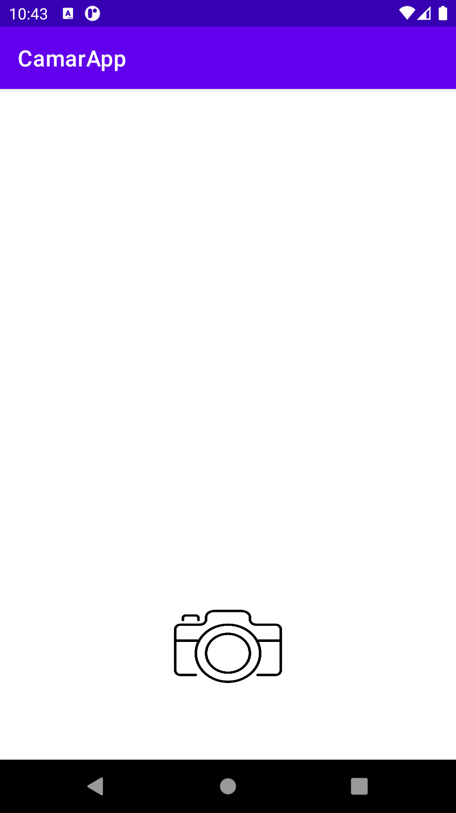
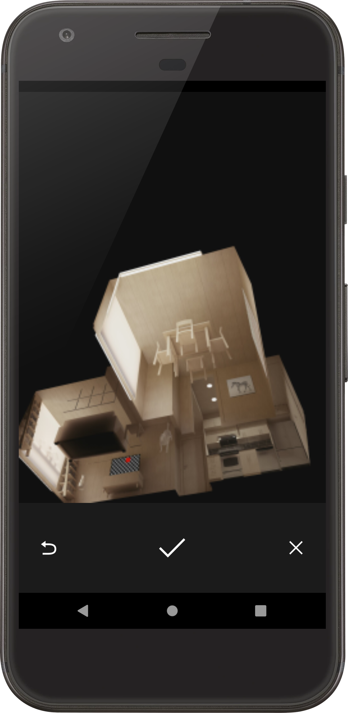
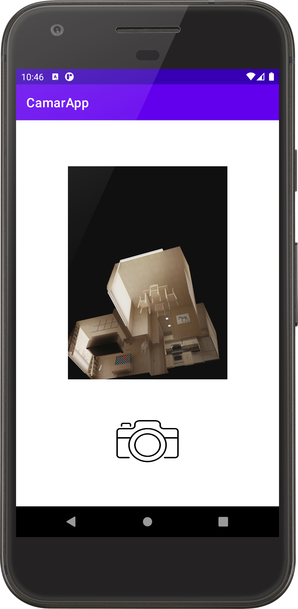

# MODULO 3 | Desarrollo de Aplicaciones Móviles Android Java | Ignacio Cavallo


#### https://github.com/cavigna/modulo_desarrollo_de_aplicaciones_moviles_android_java

## Clase 48 | 07-07


La aplicación del día fue:
> **Una app que saque fotos y la muestre!**


*Como siempre el código al final de este [readme!](#código).*


## Resultado

### Home




### Sacar la Foto!




### Mostrar la Foto!.


 


## Código

### Main

 ```java

 public class MainActivity extends AppCompatActivity {
     ImageButton btnCamera;
     ImageView imageView;
     static int REQUEST_IMAGE_CAPTURE = 1;

    @Override
    protected void onCreate(Bundle savedInstanceState) {
        super.onCreate(savedInstanceState);
        setContentView(R.layout.activity_main);

        btnCamera = findViewById(R.id.btnCamara);
        imageView = findViewById(R.id.imageView);

        btnCamera.setOnClickListener(new View.OnClickListener() {
            @Override
            public void onClick(View v) {

                abrirCam();
            }
        });


    }

    private void abrirCam(){
        Intent intent = new Intent(MediaStore.ACTION_IMAGE_CAPTURE);
            startActivityForResult(intent,  REQUEST_IMAGE_CAPTURE);
    }


    @Override
    protected void onActivityResult(int requestCode, int resultCode, Intent data) {
        super.onActivityResult(requestCode, resultCode, data);
        if (requestCode == REQUEST_IMAGE_CAPTURE && resultCode == RESULT_OK) {
            Bundle extras = data.getExtras();
            Bitmap imageBitmap = (Bitmap) extras.get("data");            
            imageView.setImageBitmap(imageBitmap);
            
        }
    }
}


```


El código  completo:  

https://github.com/cavigna/modulo_desarrollo_de_aplicaciones_moviles_android_java/tree/main/Clase_48__07-07