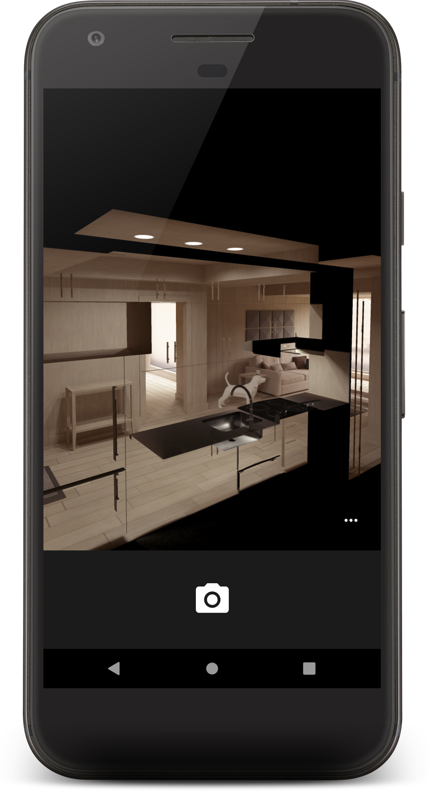
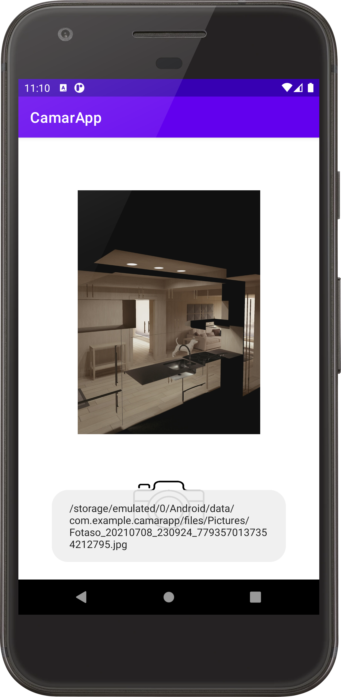

# MODULO 3 | Desarrollo de Aplicaciones Móviles Android Java | Ignacio Cavallo


#### https://github.com/cavigna/modulo_desarrollo_de_aplicaciones_moviles_android_java

## Clase 49 | 08-07


La aplicación del día fue:
> **Una app que saque fotos, la muestre y las guarde!!!**


*Como siempre el código al final de este [readme!](#código).*


## Resultado

### Foto!
*Al parecer soy un fantasma :ghost: o mis paredes son de vidrio :crystal_ball:* 



### Guardado




### Galeria


 


## Código

### Main

 ```java

 package com.example.camarapp;

import androidx.appcompat.app.AppCompatActivity;
import androidx.core.content.FileProvider;

import android.annotation.SuppressLint;
import android.content.Intent;
import android.graphics.Bitmap;
import android.graphics.BitmapFactory;
import android.net.Uri;
import android.os.Bundle;
import android.os.Environment;
import android.provider.MediaStore;
import android.util.Log;
import android.view.View;
import android.widget.ImageButton;
import android.widget.ImageView;
import android.widget.Toast;

import java.io.File;
import java.io.IOException;
import java.text.SimpleDateFormat;
import java.util.Date;

public class MainActivity extends AppCompatActivity {
     ImageButton btnCamera;
     ImageView imageView;
     static int REQUEST_IMAGE_CAPTURE = 1;
     String currentPhotoPath;

    private static final String AUTHORITY=
            BuildConfig.APPLICATION_ID+".fileprovider"; //+".provider"
    @Override
    protected void onCreate(Bundle savedInstanceState) {
        super.onCreate(savedInstanceState);
        setContentView(R.layout.activity_main);

        btnCamera = findViewById(R.id.btnCamara);
        imageView = findViewById(R.id.imageView);

        btnCamera.setOnClickListener(new View.OnClickListener() {
            @Override
            public void onClick(View v) {

                abrirCam();
            }
        });


    }

    private void abrirCam(){
        Intent intent = new Intent(MediaStore.ACTION_IMAGE_CAPTURE);
        File imagenArchivo = null;
        try {
            imagenArchivo = crearImagen();
        } catch (IOException exception){
            Log.e("Error", exception.toString());
        }
        if (imagenArchivo != null){
            Uri imagenURI = FileProvider.getUriForFile(this,
                    AUTHORITY,
                    imagenArchivo);
            intent.putExtra(MediaStore.EXTRA_OUTPUT, imagenURI);
            startActivityForResult(intent,  REQUEST_IMAGE_CAPTURE);

        }


    }


    private File crearImagen() throws IOException {

        @SuppressLint("SimpleDateFormat") String timeStamp = new SimpleDateFormat
                ("yyyyMMdd_HHmmss").format(new Date());
        String imageFileName = "Fotaso_" + timeStamp + "_";
        //File storageDir = Environment.getExternalStorageDirectory();
        File storageDir = getExternalFilesDir(Environment.DIRECTORY_PICTURES);
        File image = File.createTempFile(
                imageFileName,
                ".jpg",
                storageDir
        );


        currentPhotoPath = image.getAbsolutePath();
        return image;
    }

    private void galleryAddPic() {
        Intent mediaScanIntent = new Intent(Intent.ACTION_MEDIA_SCANNER_SCAN_FILE);
        File f = new File(currentPhotoPath);
        Uri contentUri = Uri.fromFile(f);
        mediaScanIntent.setData(contentUri);
        this.sendBroadcast(mediaScanIntent);
        Toast.makeText(this, currentPhotoPath, Toast.LENGTH_SHORT).show();
    }

    @Override
    protected void onActivityResult(int requestCode, int resultCode, Intent data) {
        super.onActivityResult(requestCode, resultCode, data);
        if (requestCode == REQUEST_IMAGE_CAPTURE && resultCode == RESULT_OK) {
            //Bundle extras = data.getExtras();
            //Bitmap imageBitmap = (Bitmap) extras.get("data");
            Bitmap imageBitmap = BitmapFactory.decodeFile(currentPhotoPath);
            imageView.setImageBitmap(imageBitmap);
            galleryAddPic();
        }
    }
}


```


El código  completo:  

https://github.com/cavigna/modulo_desarrollo_de_aplicaciones_moviles_android_java/tree/main/Clase_49__08-07