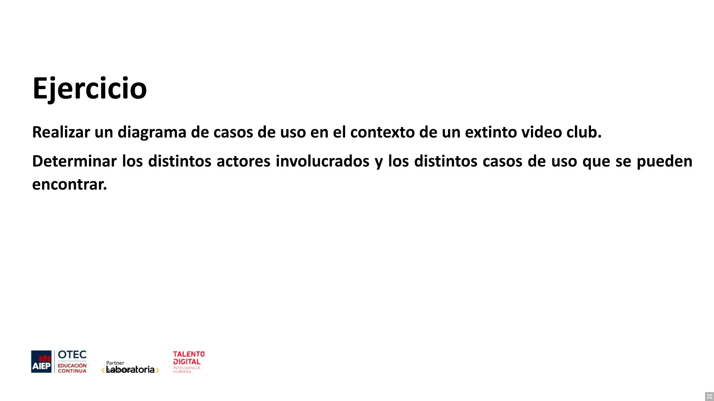
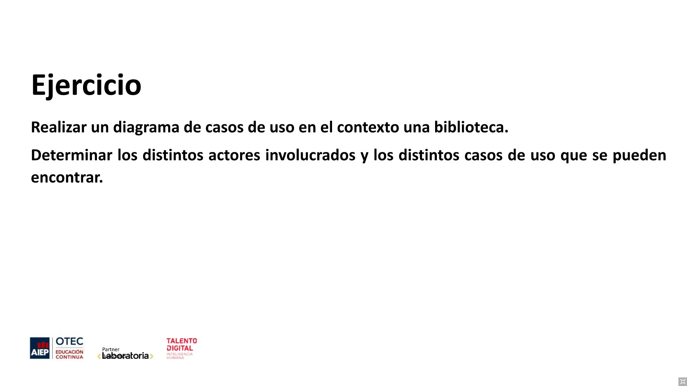
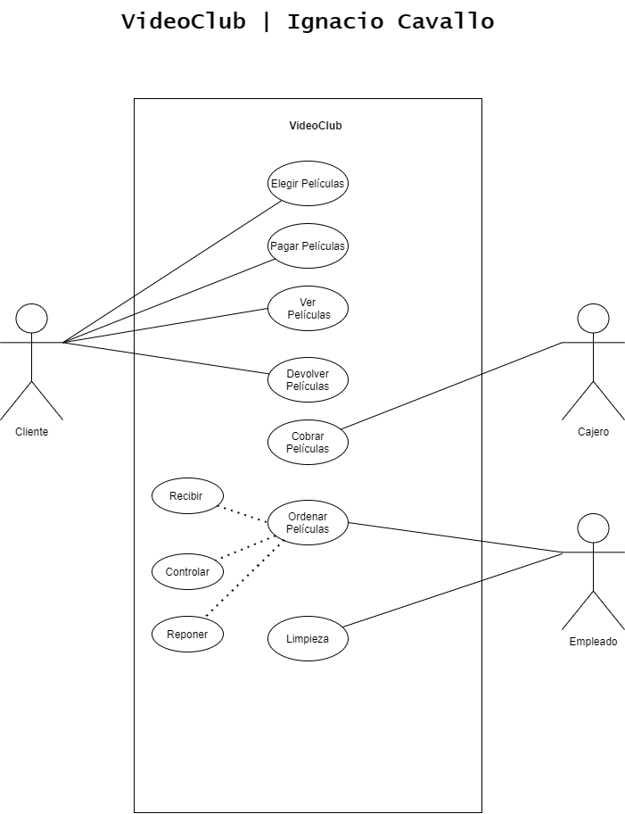
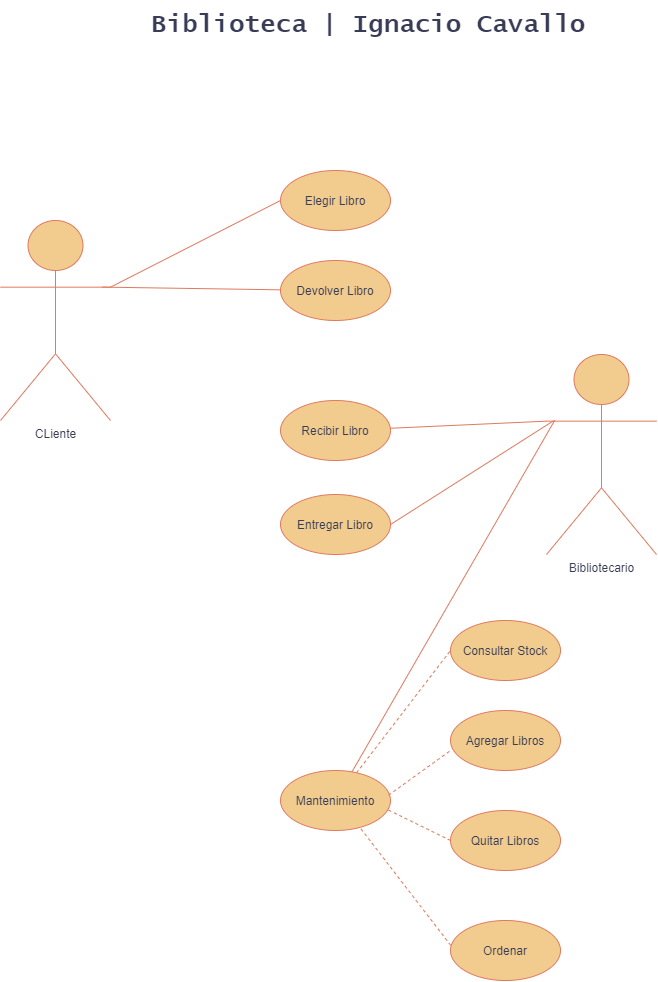

# MODULO 3 | Desarrollo de Aplicaciones Móviles Android Java | Ignacio Cavallo

#### https://github.com/cavigna/modulo_desarrollo_de_aplicaciones_moviles_android_java

## Clase 50 | 09-07

Feliz Día de la Independencia, Argentina!!

---

>La clase de hoy aprendimos Usos de Casos

--- 
## Resultado

### VideoClub

### Ejercicio 2

 

