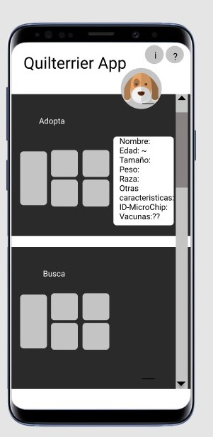

# MODULO 3 | Desarrollo de Aplicaciones Móviles Android Java | Ignacio Cavallo


#### https://github.com/cavigna/modulo_desarrollo_de_aplicaciones_moviles_android_java

## Clase 54 | 15-07

Estoy trabajando en la aplicación propuesta por el profesor y en Quilterrier.

## GastApp

```java

package com.example.gastapp;

import androidx.lifecycle.LiveData;
import androidx.room.Dao;
import androidx.room.Delete;
import androidx.room.Insert;
import androidx.room.Query;
import androidx.room.Update;

import java.util.List;

@Dao
public interface GastosDao {

        @Insert
        void insert(Gastos gastos );

        @Update
        void update(Gastos gastos);

        @Delete
        void delete(Gastos gastos);

        @Query("DELETE  FROM tabla_gastos")
        void deleteAllGastos();

        @Query("SELECT * FROM tabla_gastos ")
        LiveData<List<Gastos>> selectAllGastos();


}
```

## QuilTerrier



 


