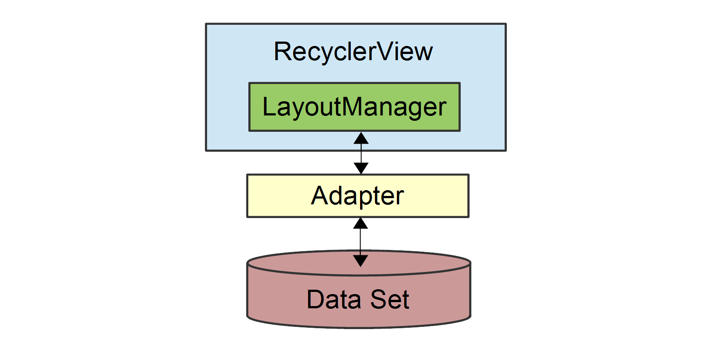
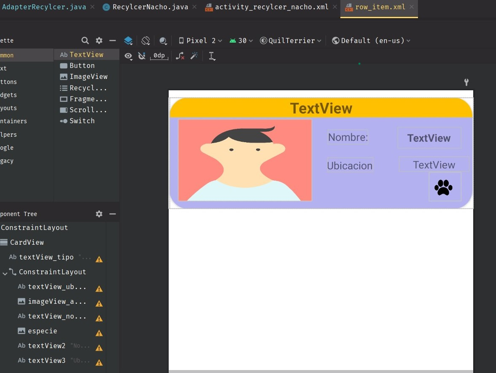
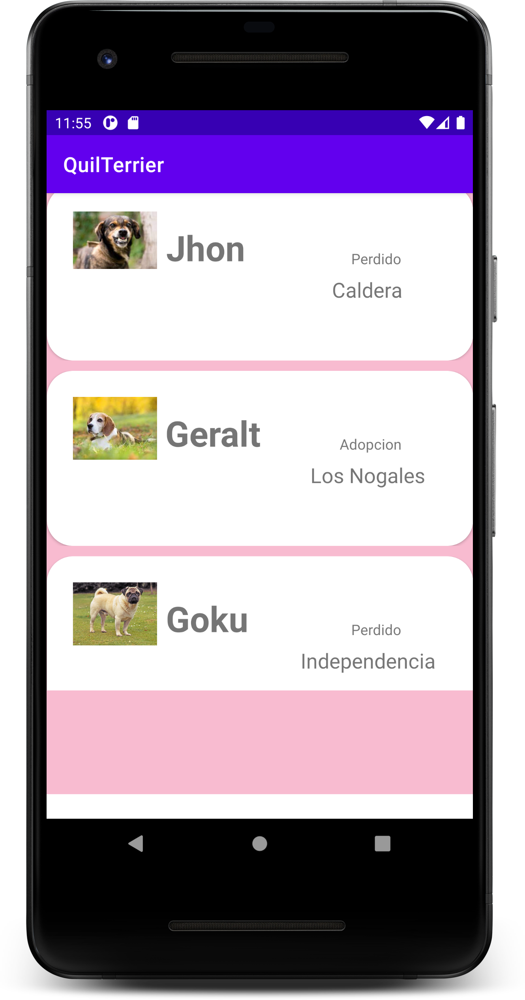
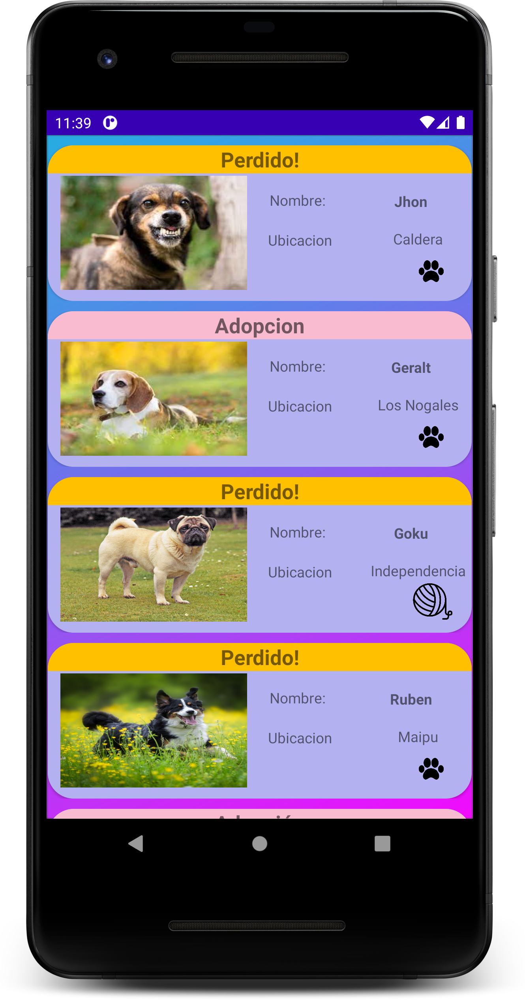

# QuilTerrier


## Main Activity

Se dispuso realizar un landing que incluyera un RecylcerView con los últimas mascotas perdidas o en adopción. 

Como podemos observar, se deben Implementar:
* DataSet
* Adapter
* RecylcerView

### Data Set
Al ser un mock up, se implementó de la siguiente manera:

Agregamos algunos <string-array> con los diferentes perros/gatos, su clasificación, su ubicación y si es perro o gato.

```xml
<resources>
    <string name="app_name">QuilTerrier</string>

    <string-array name="nombre_perro">
        <item>Jhon</item>
        <item>Geralt</item>
        <item>Goku</item>
        <item>Ruben</item>
        <item>Mara</item>
    </string-array>

    <string-array name="tipo">
        <item>Perdido!</item>
        <item>Adopcion</item>
        <item>Perdido!</item>
        <item>Perdido!</item>
        <item>Adopción</item>
    </string-array>

    <string-array name="ubicacion">
        <item>Caldera</item>
        <item>Los Nogales</item>
        <item>Independencia</item>
        <item>Maipu</item>
        <item>Valparaíso</item>
    </string-array>
    <string-array name="especie">
        <item>Perro</item>
        <item>Perro</item>
        <item>Gato</item>
        <item>Perro</item>
        <item>Perro</item>
    </string-array>

</resources>

```   

### Adapter

Se creó una clase que extiende de RecyclerView.Adapter y necesita nuestro propio viewHolder, en este caso lo llamamos MyViewHolder. A este se le asocian los elementos de la UI, como botones, textview, etc.
Hay dos cosas importantes a destacar:
* Utilizamos el **```LayoutInflater.from(parent.getContext()).inflate(R.layout.row_item```**. Este marca que se debe *inflar* el layout Row item, que solo tiene una Cardview, y esta será reproducida n veces siendo n la cantidad de datos.



* **``onBindViewHolder(@NonNull MyViewHolder holder, int position)``** implica que vamos a unir(bind), el holder(MyViewHolder) con la posición de la *"lista"*. Ahí explicitamente le estamos informando que en función al holder, defina, texto, color, e incluso imagenes.


```java
public class AdapterRecylcer extends RecyclerView.Adapter<AdapterRecylcer.MyViewHolder> {
    String name[], type[], location[], especieAnimal[];
    int images[];
    Context context;


    public AdapterRecylcer(Context ctx, String nombre[], String tipo[], String ubicacion[], String especieArr[],
                           int img[]) {
        context = ctx;
        name = nombre;
        type = tipo;
        location = ubicacion;
        images = img;
        especieAnimal = especieArr;

    }

    public class MyViewHolder extends RecyclerView.ViewHolder {
        TextView nombre, tipo, ubicacion;
        ImageView imageView_animal, especie;

        public MyViewHolder(@NonNull View itemView) {
            super(itemView);
            imageView_animal = itemView.findViewById(R.id.imageView_animal);
            nombre = itemView.findViewById(R.id.textView_nombre);
            tipo = itemView.findViewById(R.id.textView_tipo);
            ubicacion = itemView.findViewById(R.id.textView_ubicacion);
            especie = itemView.findViewById(R.id.especie);
        }
    }

    @NonNull
    @Override
    public MyViewHolder onCreateViewHolder(ViewGroup parent, int viewType) {
        View view = LayoutInflater.from(parent.getContext()).inflate(
                R.layout.row_item, parent, false);
        return new MyViewHolder(view);
    }

    @Override
    public void onBindViewHolder(@NonNull MyViewHolder holder, int position) {
        holder.nombre.setText(name[position]);
        holder.tipo.setText(type[position]);
        cambiarColorcitoDeNico(holder, position);
        cambiarImagencitaDeNico(holder, position);

        //holder.tipo.setBackgroundColor(context.getResources().getColor(R.color.amarillo_patito));
        holder.ubicacion.setText(location[position]);
        holder.imageView_animal.setImageResource(images[position]);

    }

    @Override
    public int getItemCount() {
        return 5;
    }

    public void cambiarColorcitoDeNico(MyViewHolder holder, int position) {
        if (type[position].equals("Perdido!")) {
            holder.tipo.setBackgroundColor(context.getResources().getColor(R.color.amarillo_patito));
        } else {
            holder.tipo.setBackgroundColor(context.getResources().getColor(R.color.rosado_profesor));
        }
    }

    public void cambiarImagencitaDeNico(MyViewHolder holder, int position) {
        if (especieAnimal[position].equals("Gato")) {
            holder.especie.setImageResource(R.drawable.yarnball);
        } else {
            holder.especie.setImageResource(R.drawable.pata);
        }
    }

}
```


### RecyclerView
Aquí es importante observar que ```AdapterRecylcer adapterRecylcer = new AdapterRecylcer (RecylcerNacho.this,nombre, tipo, ubicacion, especie, images);``` cumple la función de **UNIR** el adaptador con la vista.

```java
public class RecylcerNacho extends AppCompatActivity {
    RecyclerView recyclerView;

    String nombre[], tipo[], ubicacion[] , especie[];
    int images[] ={R.drawable.uno, R.drawable.dos, R.drawable.tres,
            R.drawable.cuatro, R.drawable.cinco};

    @Override
    protected void onCreate(Bundle savedInstanceState) {
        super.onCreate(savedInstanceState);
        setContentView(R.layout.activity_recylcer_nacho);

        recyclerView = findViewById(R.id.recyclerview);

        nombre = getResources().getStringArray(R.array.nombre_perro);
        tipo = getResources().getStringArray(R.array.tipo);
        ubicacion = getResources().getStringArray(R.array.ubicacion);
        especie = getResources().getStringArray(R.array.especie);
        AdapterRecylcer adapterRecylcer = new AdapterRecylcer(RecylcerNacho.this,
                nombre, tipo, ubicacion, especie, images);
        recyclerView.setAdapter(adapterRecylcer);
        recyclerView.setLayoutManager(new LinearLayoutManager(this));


    }
}
```

# RESULTADO

### Así empezó  
</br>





### Así terminó 
</br>





### Inspiración de Menu /Filtro / Cards /Me gusta


### Inspiración Card


## TODO

1. FireBase
2. Maps 
3. RecyclerView + Card + Border Radius
4. Navbar???
5. Animations??
6. Activity o Fragment?
7. ModelViewViewModel????

## MainActivity
1. TextView.
2. Button
3. RecyclerView
   1. CardView
   2. ImageView
   3. TextView
4. Menu
x