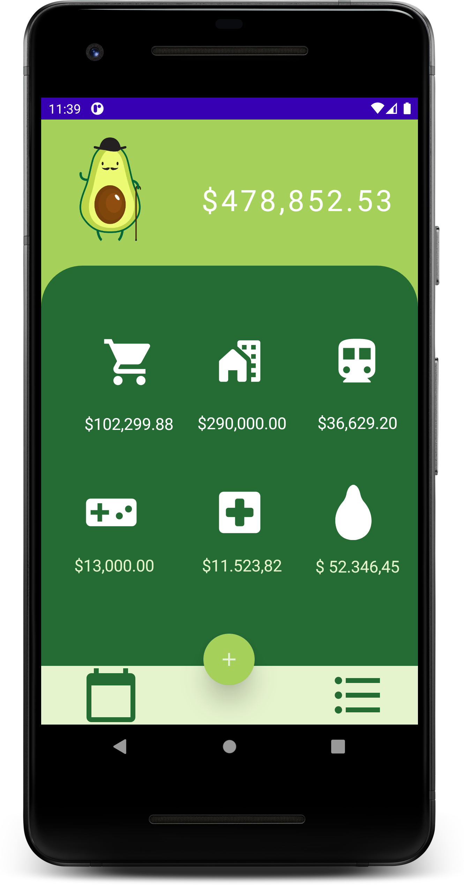
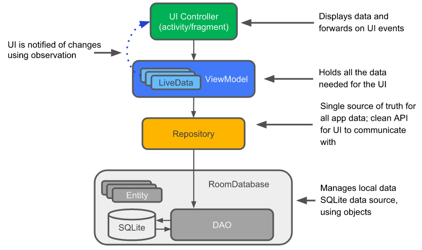

# MODULO 3 | Desarrollo de Aplicaciones Móviles Android Java | Ignacio Cavallo


https://github.com/cavigna/modulo_desarrollo_de_aplicaciones_moviles_android_java
</br>
</br>

# EXAMEN  |  Clase 55 | 19-07
</br>
</br>

# PaltaApp

Siguiendo los lineamientos del profesor, construí una app que llevara la cuenta de los gastos, y que el usuario pueda agregarlos o eliminarlos junto a una vista que permita comparar mes a mes y le agregue otra vista con los ultimos gastos.

Como desafío me propuse usar lo aprendido en clase, junto a otras herramientas que no fueron impartidas, pero que son imprescindibles en el desarrollo de aplicaciones en Android, entre ellas destaco a **RecyclerView, arquitectura MVVM, y el uso de Jetpack Room** en oposición a SQlite directo. Por ende, explicaré lo siguiente:
1. [Diseñar la App con Arquitectura ModelView ViewModel (MVVM)](#model-view-viewmodel)
2. [Android Room para SQL.](#android-room)
3. Recyclerview

### Model View ViewModel


Consiste en separar la UI (Interfaz Gráfica), de los View Model(Intermediario entre Business Logic y UI) de los Model(Business Logic) por medio de un Repositorio( Este ultimo no es Obligatorio, pero sí, sugerido). Esto requiere que en las Activities solo exista código relativo a la UI, o la interfaz gráfica, pero que no, haya nada relativo a la lógica de la App. A su vez, se requieren Holders, ViewModels y Adaptadores para los RecyclerView.  

Por ende mi Proyecto quedó con la siguiente estructura:
</br>


*  **UI**: Incluye las Activities, solo con los aspectos visuales.
*  **DB**: Incluye la Clase base **``Gasto.java``**, Su respectivo DAO **``GsDao.java``**, la construcción de la db **``GsDatabase.java``** y el repositorio **``GsRepositorio.java``**
*  **Holder**: Aquí encontramos los holders que se conecta de forma directa con la lógica de la App en el ViewModel. Son una de las tantas capas de abstracción que suguiere *Google*
*  **ViewModel o Model**: Acá está la *``verdad de la Milanesa``*, es el lugar donde ocurre gran parte de la lógica.
*  **Adapter** : Son los adaptadores requeridos para las vistas que contienen listados.


Se buscó replicar este diagrama:
</br>




### Android Room
¿Pero que es este famoso Android Room?

>Room es una librería que abstrae el uso de SQLite al implementar una capa intermedia entre esta base de datos y el resto de la aplicación. De esta forma se evitan los problemas de SQLite sin perder las ventajas de su uso. 
>Room funciona con una arquitectura cuyas clases se marcan con anotaciones preestablecidas. Por otro lado, la mayoría de las consultas a la base de datos sí se comprueban en tiempo de compilación.

Entonces tenemos:


#### Entity
En *PaltApp* la entidad consiste en una clase con la anotación: ```@Entity```, en mi caso fue la de ``Gasto.java``:
```java
package com.example.paltapp.db;

import androidx.room.Entity;
import androidx.room.PrimaryKey;

@Entity(tableName = "tabla_gastos")
public class Gasto {

    @PrimaryKey(autoGenerate = true)
    private int id;
    private String categoria;
    private String nombre;
    private String fecha;
    private double monto;
    private double total;

    // Construnctor
    public Gasto( String categoria, String nombre, String fecha, double monto) {
        this.nombre = nombre;
        this.categoria = categoria;
        this.fecha = fecha;
        this.monto = monto;
    }

    // GETTERS AND SETTERS.
 /*....*/
```   

 Esta clase cumple la función de un mapeado del comando ``CREATE`` de una tabla en SQLite. Por ende, Cada uno de los Atributos será una de las columnas de la tabla:


#### DAO

Una vez que tengamos la entidad debemos crear un **Data Access Object (DAO)**. Este representa un mapeado de operaciones SQL a métodos.

Lo que quiere decir que crearemos, leeremos, actualizaremos y eliminaremos registros desde ellos.
```java
package com.example.paltapp.db;


import androidx.lifecycle.LiveData;
import androidx.room.Dao;
import androidx.room.Delete;
import androidx.room.Insert;
import androidx.room.OnConflictStrategy;
import androidx.room.Query;
import androidx.room.RawQuery;
import androidx.room.Update;


import java.util.List;

@Dao
public interface GsDao {

    @Insert(onConflict = OnConflictStrategy.IGNORE)
    void insertGasto(Gasto gasto);

    @Update
    void updateGasto(Gasto gasto);

    @Delete
    void deleteGasto(Gasto gasto);

    @Query("DELETE FROM tabla_gastos")
    void deleteAllGasto();


    //seleccionar todos los gastos. Usado en La lista de todos los gastos
    @Query("SELECT * FROM tabla_gastos")
    LiveData<List<Gasto>> selectAllGastos();

    //suma todos los gastos. Será usado en la Main activity para ver el total
    @Query("SELECT SUM(monto) AS value FROM tabla_gastos")
    LiveData<Double> sumAllGastos();
    
    //Suma Gs y lo ordena por fecha. Sirve para la vista de comparación Mensual
    @Query("SELECT id, categoria, fecha, nombre, monto,  SUM(monto) as total FROM" +
            " tabla_gastos group by fecha")
    LiveData<List<Gasto>> gastosMes();

```
Cabe destacar el uso de ``LiveData``:
>LiveData es una clase de contenedor de datos observable. A diferencia de un observable regular, LiveData está optimizado para ciclos de vida, lo que significa que respeta el ciclo de vida de otros componentes de las apps, como actividades, fragmentos o servicios. Esta optimización garantiza que LiveData solo actualice observadores de componentes de apps que tienen un estado de ciclo de vida activo.

Es decir, es una clase que nos permite observar de forma asincrónica los datos de nuestra db. Otra consideracion es la diferencia entre:  
```java 
LiveData<List<Gasto>> 
```  

Nos devuelve un LiveData en un formato de Lista, por que en caso que el resulatado de la Query sea más de una, necesitaremos una lista.

```Java
LiveData<Double> sumAllGastos();
```

En este caso la Query, es solo un número, por ende, es simplemente un Double.

#### Room DataBase

Es el punto de entrada principal para comunicar el resto de paltaApp con el esquema relacional de datos.Esta clase nos oculta la implementación de SQLiteOpenHelper para facilitarnos el acceso a la base de datos.
```java
package com.example.paltapp.db;

import android.content.Context;

import androidx.annotation.NonNull;
import androidx.room.Database;
import androidx.room.Room;
import androidx.room.RoomDatabase;
import androidx.sqlite.db.SupportSQLiteDatabase;

import java.util.concurrent.ExecutorService;
import java.util.concurrent.Executors;

@Database(entities = Gasto.class, version = 2, exportSchema = false)
public abstract class GsDatabase extends RoomDatabase {

    public abstract GsDao gsDao();

    private static GsDatabase minstance; // singleton
    private static final String DB_NAME = "gastos_database";

    private static final int NUMBER_OF_THREADS = 4;

    static final ExecutorService databaseWriteExecutor =
            Executors.newFixedThreadPool(NUMBER_OF_THREADS);

    public static  GsDatabase getDatabase(final Context context) {

        if (minstance == null) {
            synchronized (GsDatabase.class){
                if (minstance == null){
                minstance =  Room.databaseBuilder(context.getApplicationContext(),
                        GsDatabase.class, DB_NAME)
                        .fallbackToDestructiveMigration()
                        .addCallback(sRoomDatabaseCallback)
                        .build();
                }
            }

        }


        return minstance;
    }

    private static RoomDatabase.Callback sRoomDatabaseCallback = new RoomDatabase.Callback() {


        @Override
        public void onCreate(@NonNull SupportSQLiteDatabase db) {
            super.onCreate(db);
            databaseWriteExecutor.execute(() -> {
                GsDao dao = minstance.gsDao();
                
                //Llena la base de Datos al ser construida. Simplemente para testing
                Gasto gasto = new Gasto("Ocio", "Netflix", "Julio",
                        7500);
                dao.insertGasto(gasto);
                /* ...*/
            });
        }

    };
}
```
Puntos a recordar:
* `@Database(entities = Gasto.class, version = 2, exportSchema = false)`: Hace referencia a la Entidad, y la versión implica modificaciones. Empezé con una version 1, pero luego tuve que agregar una columna total para poder hacer querys(si no, hay ciertas consultas que dan error), entonces tuve que hacer una version 2. 
* `private static GsDatabase minstance;`: Es un singleton y  consiste en garantizar que una clase solo tenga una instancia. Solo realizamos una única instancia de la db.
* ```java
          if (minstance == null) {
            synchronized (GsDatabase.class){
                if (minstance == null){
                minstance =  Room.databaseBuilder(context.getApplicationContext(),
                        GsDatabase.class, DB_NAME)
                        .fallbackToDestructiveMigration()
                        .addCallback(sRoomDatabaseCallback)
                        .build();
                }
  ```
  Si no existe una instancia de la db, entonces, construimos una incluyendo un callBack que permite crear dummy data(para que la db este con algunos datos.)

#### Repositorio | Model
Estas dos clases las presento juntas, ya que el repositorio no es obligatorio, es una recomendación de Google a la hora de implementar MVVM, generando una capa mas de abstración. Veremos que el código se repite en estas clases  

##### Repositorio
```java
ackage com.example.paltapp.db;

import android.app.Application;

import androidx.lifecycle.LiveData;

import java.util.List;

public class GsRepositorio {

    private GsDao gsDao;
    private LiveData<List<Gasto>> mAllGastos;
    private LiveData<List<Gasto>> mgastosMes;

    private LiveData<Double> msumaGsCate;
    private LiveData<Double> msumaAllGs;

    private LiveData<Double> msumaGsCat2;

    
    private String categoria;


    public GsRepositorio(Application application) {
        GsDatabase database = GsDatabase.getDatabase(application);
        gsDao = database.gsDao();
        mAllGastos = gsDao.selectAllGastos();
        msumaGsCate = gsDao.SumGastosCategoria();
        msumaAllGs = gsDao.sumAllGastos();
        msumaGsCat2 = gsDao.sumGsCat2(categoria);

        mgastosMes = gsDao.gastosMes();

    }


    public LiveData<List<Gasto>> selectAllGastos() {
        return mAllGastos;
    }

    public LiveData<Double> sumaGastosCategoria() {return msumaGsCate;}

    public LiveData<Double> sumaAllGs() {return msumaAllGs; }

    public LiveData<List<Gasto>> gastosMes() {
        return mgastosMes;
    }

    public LiveData<Double> sumaGsCat2(String categoria){
    return gsDao.sumGsCat2(categoria);
}

    // SQLite QUERIES definidas en DAO que se ejecuntan en el REPO.


    public void insert(Gasto gasto) {
        GsDatabase.databaseWriteExecutor.execute(()
                -> gsDao.insertGasto(gasto));
    }

    public void update(Gasto gasto) {
        GsDatabase.databaseWriteExecutor.execute(()
                -> gsDao.updateGasto(gasto));
    }

    public void delete(Gasto gasto) {
        GsDatabase.databaseWriteExecutor.execute(()
                -> gsDao.deleteGasto(gasto));
    }

    public void deleteAll() {
        GsDatabase.databaseWriteExecutor.execute(()
                -> gsDao.deleteAllGasto());
    }
```

###### Model

```java

```


## QuilTerrier


 


